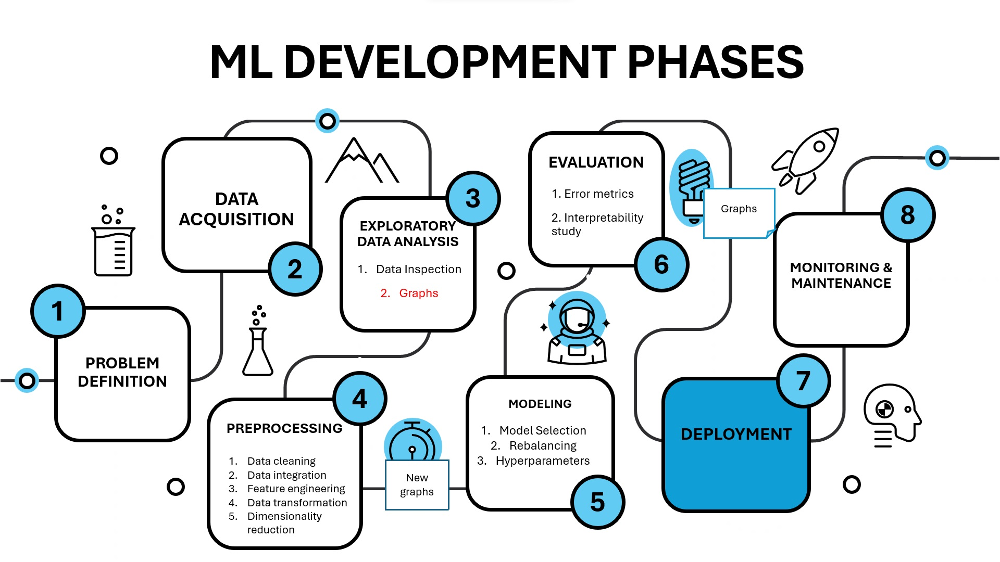
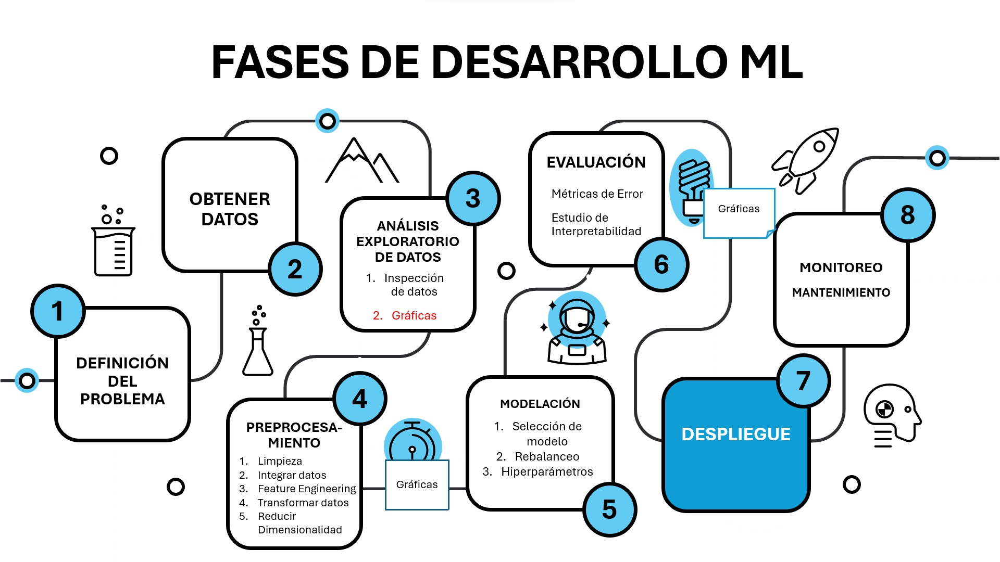

# Machine_Learning_Development_Phases

[🇺🇸 **English**](#english) | [🇪🇸 **Español**](#español)

---

## English

### Overview
This repository covers the different phases of machine learning development (not deployment), as illustrated in the image below. Each folder corresponds to a phase, containing code and examples to guide the user through the machine learning lifecycle.

---

### Topics and Subtopics

#### 1. Problem Definition

#### 2. Data Collection
- **From Text** 
- **From Images**

#### 3. Exploratory Data Analysis (EDA)
- **Descriptive Analysis with Pandas & Numpy**
- **Graphs with Matplotlib y Seaborn**

#### 4. Data Preprocessing
- **Data Cleaning**
- **Combining and Reshaping datasets**
- **Data Transformation**

#### 5. Modeling
- **Hyperparameter Tuning (gridsearch-randomsearch)**
- **Development Pipeline scikit-learn** 

#### 6. Evaluation

---

### Purpose
This repository aims to:
- Guide users through the machine learning development lifecycle.
- Provide examples and best practices for each phase.

---

## Español

### Descripción
Este repositorio cubre las diferentes fases del desarrollo (no implementación en producción) de aprendizaje automático, como se ilustra en la imagen a continuación. Cada carpeta corresponde a una fase, conteniendo código y ejemplos para guiar al usuario a través del ciclo de vida del aprendizaje automático.

---

### Temas y Subtemas

#### 1. Definición del Problema

#### 2. Obtención de Datos
- **De texto** 
- **De imágenes**

#### 3. Análisis Exploratorio de Datos (EDA)
- **Análisis descriptivo con Pandas y Numpy** 
- **Gráficas con Matplotlib y Seaborn**

#### 4. Preprocesamiento de Datos
- **Limpieza de datos**
- **Integración de bases**
- **Transformación de datos**

#### 5. Modelado
- **Afinación de hiperparámetros**
- **Tubería de desarrollo con scikit-learn**

#### 6. Evaluación

---

### Propósito
Este repositorio tiene como objetivo:
- Guiar a los usuarios a través del ciclo de vida del desarrollo de aprendizaje automático.
- Proveer ejemplos y buenas prácticas para cada fase.
---

Happy learning and coding! 🚀 / ¡Feliz aprendizaje y programación! 🚀
